# The 2nd Project Portfolio of CI

### Find That Dinner

Project URL: [View live project](https://mtraveller.github.io/find-that-dinner/index.html "The Website")

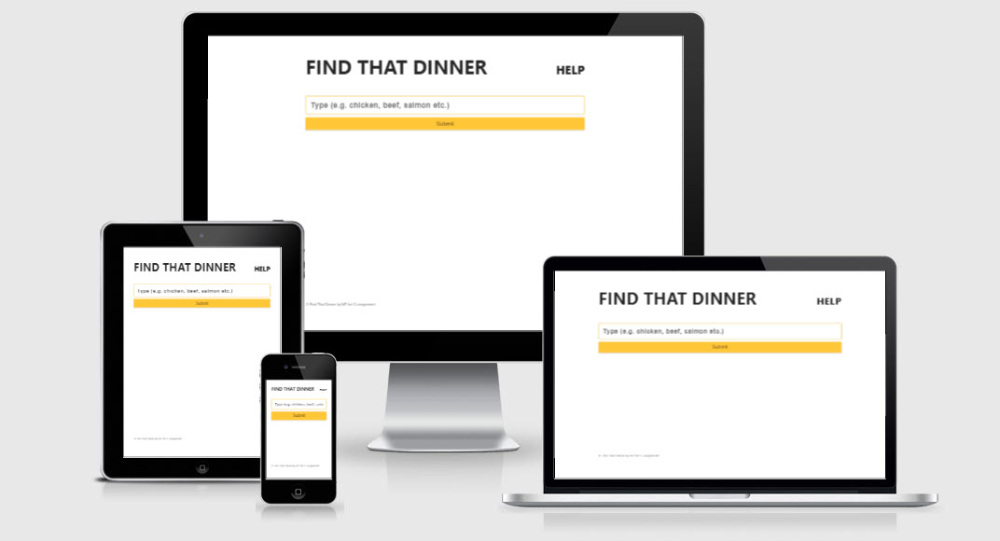

## User Experience (UX)

-   ### User stories

    -   #### First Time Visitor Goals

        1. As a First Time Visitor, I want to understand the site's primary purpose quickly.
        2. As a First Time Visitor, I want to easily navigate throughout the site and easily initiate a search.
        3. As a first-time visitor, I want to look for things that make the site trustworthy.

    -   #### Returning Visitor Goals

        1. As a Returning Visitor, I want to be able to share the site's content.

-   ### Design

    -   #### Colour Scheme

        -   The three main colors used are black  #272727, white  #FFFFFF and yellow  #FFC600.

    -   #### Typography
        -   I decided to go with: `-apple-system, BlinkMacSystemFont, "Segoe UI", Roboto, Helvetica, Arial, sans-serif;` for performance sake. The system font that people are used to on their decides works great for this type of project while keeping the weight of the website ligther.

    -   #### Imagery & Video

        -   All recipe images are provided by edamam.com from their database through their api.

*   ### Wireframes

    -   Mockflow.com was used to design the initial layout for desktop and mobile screens.

        | Desktop | Mobile |
        |:--------:|:--------:|
        | [Front](https://github.com/MTraveller/find-that-dinner/blob/308d642fbca484f52b51bbf2202c56bddf63387a/assets/images/readme/desktop.jpg) | [Front](https://github.com/MTraveller/find-that-dinner/blob/308d642fbca484f52b51bbf2202c56bddf63387a/assets/images/readme/mobile.png) |

## Table of Contents

* [Planes](#planes)
    * [The Surface](#surface)
    * [Skeleton](#skeleton)
    * [Structure](#structure)
    * [Scope](#scope)
    * [Strategy](#strategy)
* [Development](#development)
    * [HTML](#dev-html)
    * [CSS](#dev-css)
    * [Javascript](#dev-javascript)
    * [Images](#images)
    * [Form](#form)
    * [Accessibility](#accessibility)
    * [Testings](#testings)
    * [Bugs](#bugs)
* [Validators](#validators)
    * [HTML](#validate-html)
    * [CSS](#validate-css)
    * [JS](#validate-javascript)
* [Deployment](#deployment)
    * [Fork](#fork)
    * [Clone](#clone)
    * [Deploy](#deploy)
* [Credits](#credits)

## Planes

### Surface

The homepage will greet the visitor with a big headline to make the website clear and precise of what it is about, followed by a help link, that explains how to use the website.

The visitor is presented with a search from when searching will return recipes for what keyword was used, through an API provided by edemame.com which has over 2.3 million recipes in their database. The free API is limited to 20 results per call and either same results or results at ramdom. The website uses the random condition.

When a search is initated the visitor would be shown 20 random recipes for the searched keyword e.g. beef, chicken etc. The recipes will be shown as a grid based layout with an image of the dish, quick info of calories and how many ingredients and a website link that the recipe is on.

A footer at the absolute bottom with a copyright notice.

### Skeleton

The header, search form and the footer do not change and are fixed at all times.

The header contains a big title and a help link.

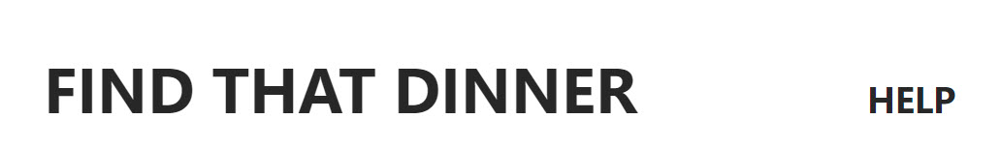

The form is big and comfortable flowing the flow of the header. 

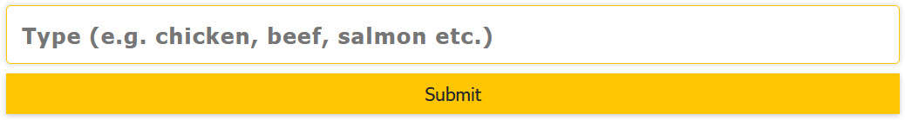

The footer is stuck to the bottom at all times with a discreet text size, enough to notice but no distract.

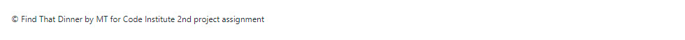

### Structure

The website targets English-speaking visitors and reads from left to right. The construct of the help link is in a linear flow with the headline for precise and pleasant view.

The website includes grids within grids based layout of text and media without being crowded yet informative.

### Scope

The website's features showcase the recipes with images, google chart pie's, and text to provide an informative read. If the need comes up, a help section is available.

### Strategy

Find That Dinner project is a website that targets english based women and men between 26-46 years old who are looking for a quick recipe.

The website based on the real world recipes posted on the web. The website provides quick informative snippets of info and leads the visitor to the recipe page for further in-depth reads.

## Development

#### Languages Used

- [HTML5](https://en.wikipedia.org/wiki/HTML5 "Wikipedia's HTML5 page")
- [CSS3](https://en.wikipedia.org/wiki/Cascading_Style_Sheets "Wikipedia's CSS3 page")
- [Javascript](https://sv.wikipedia.org/wiki/Javascript "Wikipedia's Javascript page")

### Frameworks, Libraries & Programs Used

1. [Git](https://git-scm.com/)
    - Git was used for version control by utilizing the Gitpod terminal to commit to Git and Push to GitHub.
1. [GitHub:](https://github.com/)
    - GitHub is used to store the project's code after being pushed from Git.
1. [Mockflow:](https://mockflow.com/)
    - Mockflow was used to create the [wireframes](#wireframes) during the design process.

### Dev HTML

The website is purely in `HTML`, `CSS` and `Javascript Vanilla` technologies, with no Javascript 3rd-party libraries. The website is lightweight, loads and runs super quick.

The website use tags such as `<header>` `<menu>` `<main>` `<article>` `<section>` `<aside>` `<footer>` `
` `<form>` `<input>` `` `<h1>` `<h2>` `<h3>` `<h4>` and `
`.

### Dev CSS

I have chosen not to use critical CSS in the header because of how light and how quick the website loads. The website loads in less than 400ms. The website's content utilizes the CSS grid layout module for cleaner CSS code and less @media queries.

### Dev Javascript

This is where the fun is, it was fun while it lasted. To be able to instruct a digital device to what you want it to show is an exciting achievement. The internet was a lot of help when I needed it. As the first Javascript project ever and seeing the final result, I can say that I am more than happy with the end result.

Throughout the project it was a constant battle of idea => problem => solution. This is not limited to me and is applied to all who ventures into coding. Either you like it or don't type of thing.

Things like `Ternary` if statements make Javascript lovable, seriously.

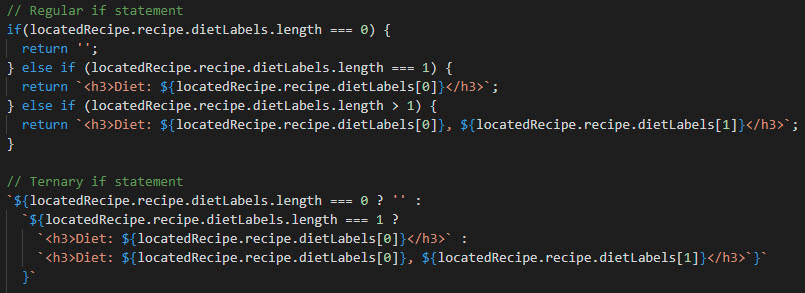

### Images

Images live inside the `` tag within the `<figure>` tag and while I tried and wanted to use the next-gen images such as avif or webp with a fallback to png or jpg, it was impossible for me to do so, because of the limited availability of free API's. I did manage to find one free API but this API turned out to operate only in http and not https resulting in mixed-content policy error which wouldn't let me access the resulting image.

### Form

On the page, there's a form, nothing special; a bit of styling to make it look appropriate and aligned with the website as a whole. The search `<input>` do have label which is set to -9999px. A placeholder attribute is used to make it look cleaner. The search input is set to required and the submit button is disabled while the fetch request happens and is enabled again after the fetch.

## Testings

Throughout the website development, I've done intensive testing in every possible way to my ability to spot and quickly, with no delay, correct the bugs as fast as possible. With every new feature or code added, I would go back and test. Test the old as the new, take a step back, contemplate, and do more testing, and the result is a clean, lightweight website that I am pleased with.

Although I am currently pleased, it can always be better, like, for example, more transitions and cool layout, specifically the modal could be better. CSS grid is big and I have yet to learn it all.

Things like `grid-template-column` and `repeat()` with `auto-fill` or `auto-fit` combined with `minmax()`, make life much easier and @media queries suddently is of the past.

Responsiveness tests was good and was tested at [Responsive Test Tool](https://responsivetesttool.com/) from desktop all the way down to width of 320px.

### Lighthouse Mobile

| Home Page |
|:--------:|
| 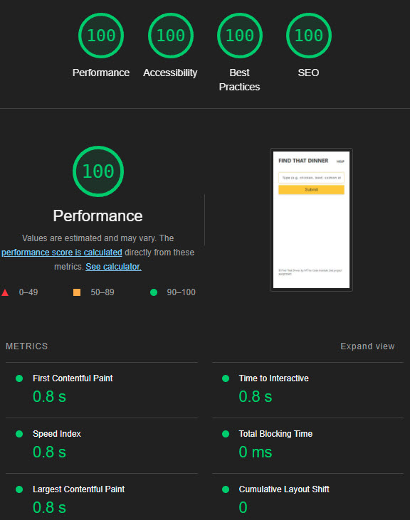 |

Digging further, Chrome's dev tool states there are no unused CSS declarations.

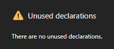

### Accessibility

The website was produced with accessibility in mind and made sure the website is user friendly as much as possible. I tested the website in Chrome's Lighthouse and on [a11y Color Contrast Accessibility Validator](https://color.a11y.com/Contrast/).

| Results |
|:--------:|
| 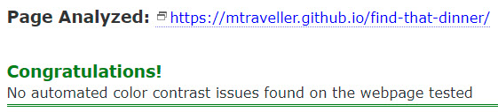 |

### Bugs

Through out the project I had many general errors, TypeErrors and inPromise errors, and solved them successfully.

At times I would get a 404 image error: 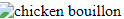

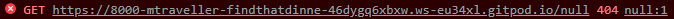

The solution would be to add a condition to check whether the API server returned an image or not and then print else exclude the image but print the figcaption only.

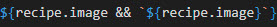

I was having issues with the Google chart pie because of having their code in different files and ended up added all their code in one file which solved this issue. Also their script needed to load after the site's scripts, because of the layout and file structure I chose to pursue.

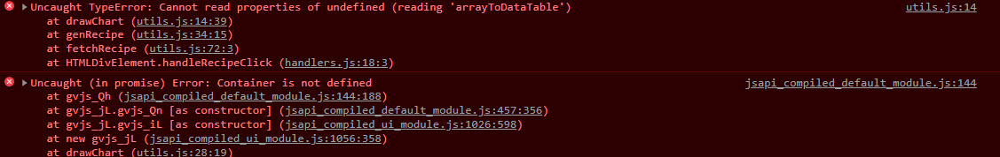

Using templates was at times confusing as I used templates more than one place and more than one Array. A small type error can easily mess up the whole thing and be stuck for hours trying to find the error. Thankfully, I was fortunate enough to quickly spot the error and fix it.

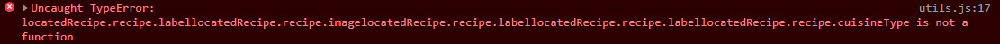

Talking about a `TypeError`, so thankfull for the browser console and `console.log('Is My Best Friend!')`, which would let me quickly understand and fix the bug / issue.

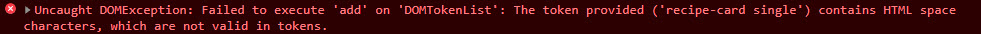

When I wanted to find and put the clicked recipe into it's own array so that I could work on that specific item separetly, I you can't really talk fluently without knowing the whole language. This is why to be able to be a JS wizz, I've set a personal mission to will keep learning JS and all it's wonders.

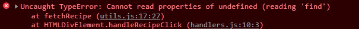

The solution was to put the first fetched results into a global array and work from there.

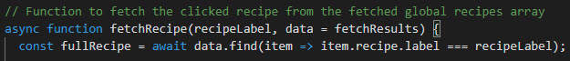

Being new to anything little mistakes happen, lesson learned. The order of `DOM`!

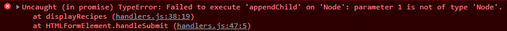

Where and timing was a bit off which triggered this error. I fixed the why, but I wanted it above all else as the firstChild in body. For that I used `prepend` as at first I was removing all children of the body. Later changed to an overlay modal above main content with a slight CSS transition of 0.4s that gives it a nice fade effect. Actually because of this effect I had to refactor my code to make it possible as `display` property does not work with CSS transition.

## Validators

### Validate HTML

No errors are displayed when passed through the official W3C validator of all three pages.

[index.html](https://validator.w3.org/nu/?doc=https%3A%2F%2Fmtraveller.github.io%2Ffind-that-dinner%2Findex.html "https://validator.w3.org/nu/")

### Validate CSS

No errors are displayed when passed through the official W3C Jigsaw validator of all three pages.

[index.html](https://jigsaw.w3.org/css-validator/validator?uri=https%3A%2F%2Fmtraveller.github.io%2Ffind-that-dinner%2F&profile=css3svg&usermedium=all&warning=1&vextwarning=&lang=en "https://jigsaw.w3.org/css-validator/")

### Validate Javascript

I ran all Javascript files through jshint.com and no errors where found. All files have warnings like `X is available in ES6` and `X is available in ES8` and even if I add 'esversion: 8'; at the top of the file it won't hide these warnings.

## Deployment

### Fork

How to fork this repository:

1. Log in to GitHub and navigate to [this repository](https://github.com/MTraveller/find-that-dinner).
2. You'll see a button called <b>Fork</b> on the top right side of the page. Click the button to create a copy of this repository to your own GitHub account.

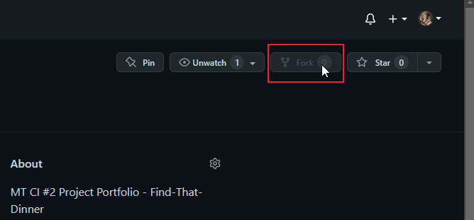

### Clone

How to clone this project:

1. Under the repository’s name, click on the <b>Code</b> button.
2. In the <b>HTTPS</b> tap, click on the clipboard icon to copy the given URL.
3. In your IDE of choice, open <b>**git bash**</b>.
4. Change the current working directory to where you want the cloned directory to be.
5. Type <b>**git clone**</b>, paste the URL copied from GitHub - https://github.com/MTraveller/find-that-dinner.git.
6. Press <b>**enter**</b>, and you are done.

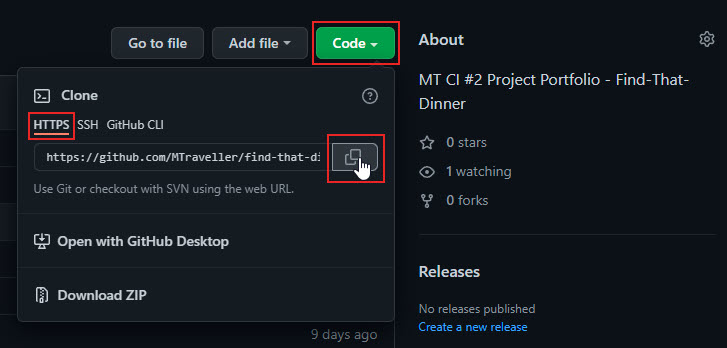

### Deploy

How to deploy this project:

  1. In the GitHub repository, navigate to the <b>Settings</b> tab.
  2. Once in Settings, navigate to the <b>Pages</b> tab on the left vertical menu.
  3. Under <b>Source</b>, select the branch to <b>Main/Master</b>, then click <b>Save</b>.
  4. Once you've selected the master branch, the page will be automatically refreshed with a detailed ribbon display to indicate the successful deployment.

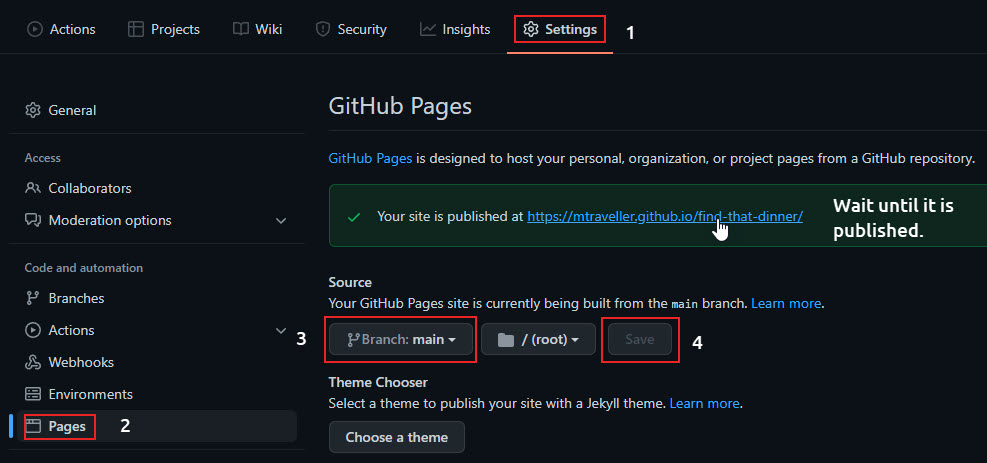

## Credits

### Content and Images

Nothing is saved on the server other than the 3 images for the favicon, email and whatsapp share links.

Favicon was provided by: [Icons8](https://icons8.com/icon/122657/real-food-for-meals "Real Food for Meals")
Email image was provided by: [Icon Scout](https://iconscout.com/icon/email-2262106 "Email Icon")
Whatsapp image was provided by: [Icon Scout](https://iconscout.com/icon/whatsapp-43 "Whatsapp Icon")

All content, images, and videos for the recipes are from the returned request API returns, the API provided access to from edemane.com. The author (I) of this project and the brand "edemane" and/or the websites linked to, are not connected/affiliated or corporated with one another in any way, and all content and images are their respectively intellectual properties only.

I have no right to any content and/or images used for this project.

[Edemame](https://www.edemame.com "edemame website")

### Sources Used

https://developer.mozilla.org

https://stackoverflow.com

https://www.google.com

## Acknowledgement

This project is part of the "Full Stack Software Developer Diploma" at [Code Institute](https://codeinstitute.net/).

MT 2022.

[Back to top](#the-2nd-project-portfolio-of-ci)